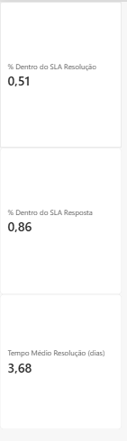
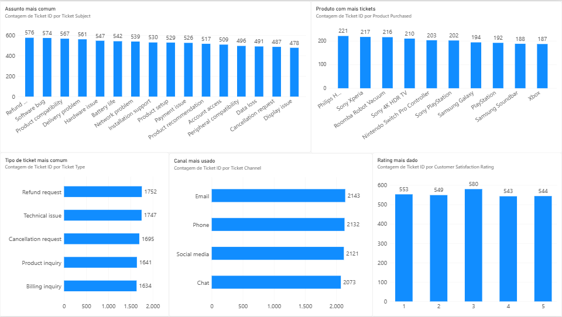
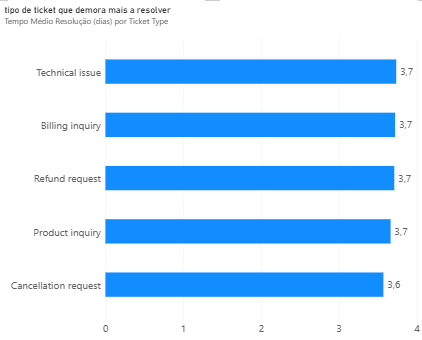
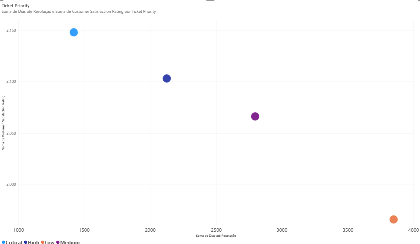
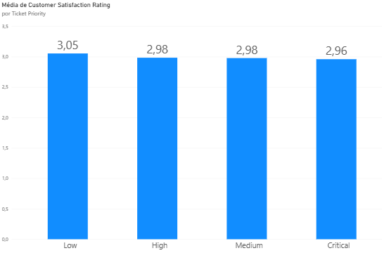

Customer Support Analytics: Impacto da Qualidade de Dados e Prioridade no Service Level e na Satisfação do Cliente

Ferramentas: Power BI · Power Query (M) · DAX Dataset: Customer Support Ticket Dataset (Kaggle, 8.469 tickets)

Dashboard
<h3 align="center">KPIs de SLA e tempo de resolução</h3> 
  
 <h3 align="center">Distribuição de tickets (tipo, assunto, produto, canal, rating)</h3> 
  
 <h3 align="center">Tempo médio de resolução por tipo de ticket</h3> 
  
 <h3 align="center">Correlação entre tempo de resolução e satisfação (com investigação crítica)</h3> 
  
 <h3 align="center">Satisfação média por prioridade</h3> 
  

Contexto

Na Hilti Portugal, geri uma carteira de clientes B2B e fui responsável por manter o service level acima de 92%, reduzir registos duplicados de clientes e assegurar a qualidade dos dados de CRM. Este projeto replica esse tipo de análise num dataset público, para demonstrar como estruturar uma pergunta de negócio, construir os KPIs certos e questionar criticamente os resultados — em vez de aceitar a primeira correlação que aparece.

Pergunta de negócio

Que fatores influenciam o tempo de resolução de tickets de apoio ao cliente, e existe uma relação real entre esse tempo e a satisfação do cliente?

Dados e metodologia

O dataset original tem 8.469 tickets, com informação de tipo, assunto, prioridade, canal, produto, primeira resposta, tempo de resolução e rating de satisfação — mas não tem uma data de abertura do ticket, o que impede o cálculo direto de métricas de SLA.

Para resolver esta lacuna, os tempos de resposta e resolução foram simulados com base na prioridade do ticket (prioridades mais altas → tempos mais curtos), com uma variação adicional por ticket para evitar valores repetidos. Esta decisão é assumida de forma transparente: qualquer conclusão que dependa destes tempos simulados é ilustrativa do método de análise, não uma descoberta definitiva sobre o dataset original.

Cerca de 1/3 das linhas têm "First Response Time" ou "Time to Resolution" em branco (tickets ainda não respondidos/resolvidos) — estas foram excluídas dos cálculos de SLA e tempo médio, mantendo uma amostra de dados completos superior a 5.600 tickets.

Principais descobertas

Service Level

86% dos tickets respondidos dentro do SLA definido (32h)
51% dos tickets resolvidos dentro do SLA definido (3 dias)
Tempo médio de resolução: 3,68 dias

Distribuição de volume

Tipo de ticket mais comum: Refund request (1.752), seguido de perto por Technical issue (1.747) — mas, no geral, os 5 tipos de ticket têm volumes muito próximos (1.634–1.752), sem nenhum a dominar claramente.
Mesmo padrão nos canais (Email 2.143, Phone 2.132, Social media 2.121, Chat 2.073) e nos produtos (o mais pedido, Philips Hue Lights, representa apenas ~2,6% do total) — o volume está distribuído de forma notavelmente equilibrada entre categorias.
Rating mais comum: 3 (580 tickets), com os restantes valores (1, 2, 4, 5) também muito próximos entre si (543–553) — não há uma concentração clara em clientes muito satisfeitos nem muito insatisfeitos.

Tempo de resolução por tipo de ticket Todos os tipos de ticket têm tempos médios de resolução quase idênticos (3,6–3,7 dias). Isto sugere que o tipo de ticket, por si só, não é um bom preditor do tempo de resolução — a prioridade atribuída pesa mais.

Satisfação por prioridade A satisfação média varia pouco entre níveis de prioridade: Low (3,05), High (2,98), Medium (2,98), Critical (2,96). A diferença é pequena, mas na direção oposta à esperada — tickets de prioridade mais baixa (e resolução mais lenta) não têm pior satisfação do que os críticos.

Investigação crítica: a correlação que não é o que parece

Uma correlação de Pearson entre "Dias até Resolução" e "Rating" deu 0,76 — um valor forte e positivo, sugerindo (à primeira vista) que tickets mais lentos têm clientes mais satisfeitos. Este resultado é contraintuitivo e merece escrutínio antes de ser aceite.

Como os tempos de resolução foram simulados a partir da prioridade, e a prioridade também está (ainda que ligeiramente) associada ao rating médio, esta correlação pode refletir um efeito de confundimento: a prioridade influencia simultaneamente o tempo simulado e, no dataset original, o rating — criando uma correlação aparente entre as duas que não é uma relação direta de causa-efeito.

Conclusão honesta: com os dados disponíveis, não é possível confirmar se existe uma relação real entre velocidade de resolução e satisfação do cliente. O valor de 0,76 deve ser lido como ilustração do método (como calcular e testar uma correlação, e como identificar quando um resultado pode ser enganador), não como uma descoberta definitiva sobre o comportamento dos clientes.

Recomendações
Registar a data de abertura real de cada ticket. Sem este campo, não é possível medir SLA de forma fiável nem isolar o efeito real do tempo de resolução sobre a satisfação — é a limitação mais importante a resolver antes de qualquer decisão operacional.
Investigar porque tickets de baixa prioridade não têm pior satisfação, apesar de resolvidos mais lentamente — pode indicar que a gestão de expectativas (comunicação, transparência sobre prazos) importa tanto ou mais do que a velocidade pura.
Não assumir que o tipo de ticket determina o tempo de resolução — os dados sugerem que a prioridade é o fator mais relevante; processos de melhoria devem ser desenhados a esse nível, não por categoria de assunto.
Monitorizar a distribuição de volume por canal/produto ao longo do tempo, já que atualmente está equilibrada — uma concentração súbita numa categoria seria um sinal de alerta a investigar.
Limitações
Tempos de resposta e resolução são simulados (ver secção "Dados e metodologia"), não observados.
A correlação rating-tempo de resolução está sujeita a um possível efeito de confundimento via prioridade, não resolvido com os dados disponíveis.
Dataset público e anonimizado — não reflete necessariamente padrões reais de um negócio específico.
Estrutura do repositório
├── README.md
├── customer-support-analytics.pbix
└── images/
    ├── 01-kpis-sla.png
    ├── 02-distribuicao-tickets.png
    ├── 03-tempo-resolucao-por-tipo.png
    ├── 04-correlacao-scatter.png
    └── 05-satisfacao-por-prioridade.png

Projeto desenvolvido por Sara Jerónimo como parte de um portfólio de Customer Analytics.
